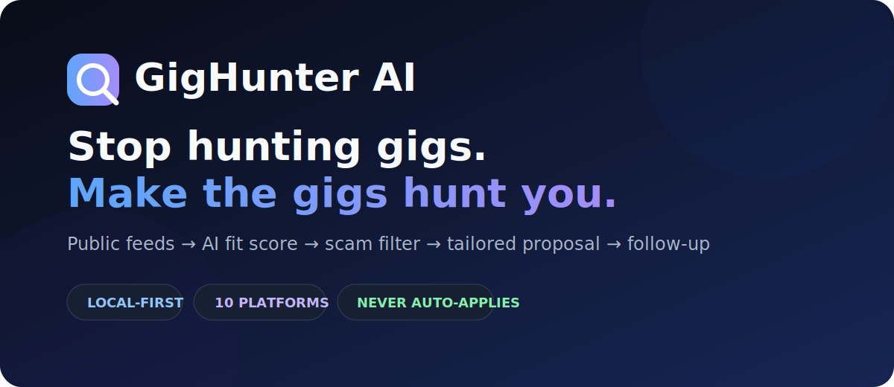

<div align="center">
  

  <br />

  **Your local-first AI freelancing copilot. It finds public gigs, scores fit, filters scams, drafts proposals, and reminds you to follow up. You make the final call.**

  [](https://github.com/abdulbasit742/gighunter-ai/actions/workflows/ci.yml)
  [](https://nodejs.org/)
  [](https://ollama.com/)
  [](LICENSE)
  [](CONTRIBUTING.md)

  [Quick start](#-60-second-start) · [How it works](#-how-it-works) · [CLI](#-one-cli-everything) · [Safety](#-built-to-help-not-spam) · [Contribute](CONTRIBUTING.md)
</div>

---

## Freelancing has a discovery problem

The best gig is often buried across ten tabs, posted while you were asleep, or lost behind fifty low-quality listings. Most tools "solve" this by auto-applying everywhere. That's a fast route to generic proposals, platform bans, and a wrecked reputation.

**GigHunter takes the opposite approach:** automate research, not judgment.

```text
public job feeds
      ↓
normalize + deduplicate
      ↓
fit score + budget intelligence + scam filter
      ↓
tailored proposal variants
      ↓
you review and submit
      ↓
follow-up reminders + win-rate learning
```

## ⚡ 60-second start

```bash
git clone https://github.com/abdulbasit742/gighunter-ai.git
cd gighunter-ai
npm install
npm run setup
npm start
```

Open **http://localhost:3000/app**.

Want terminal-only?

```bash
npm run cli -- hunt
npm run cli -- list new 10
npm run cli -- stats
```

No cloud key required. GigHunter defaults to local Ollama and still has a deterministic dry-run mode for testing.

## ✨ What makes it different

| Capability | What you get |
|---|---|
| **10-platform registry** | Public feeds work immediately, API sources activate when you add keys, drafting-only sources stay honest |
| **Local-first AI** | Score and draft privately with Ollama, with optional cloud providers |
| **Adaptive scoring** | Learns which platforms and keywords resemble your past wins |
| **Scam filter** | Flags upfront fees, off-platform payment pressure, vague scope, and other red flags |
| **Budget intelligence** | Understands `$50/hr`, `$2k-3k`, `€4k/month`, and compares pay with your floor |
| **Near-duplicate collapse** | One opportunity instead of the same repost from three boards |
| **Proposal variants** | Concise, warm, and technical angles, then you choose |
| **Portfolio matching** | Pulls the most relevant proof from your past work |
| **Follow-up engine** | Surfaces respectful day-3 and day-7 nudges |
| **ClickUp bridge** | Pushes high-score opportunities into your workflow |
| **Dashboard + CLI + API** | Use the interface that fits your day |

## 🎯 How it works

### 1. Hunt
GigHunter reads ToS-friendly public feeds and APIs. It does not scrape behind logins.

### 2. Rank
Every opportunity gets a 0-100 fit score based on skills, preferences, freshness, budget, risk, and what historically converted for you.

### 3. Draft
Strong, clean opportunities get proposal variants grounded in the actual posting and your relevant portfolio work.

### 4. Decide
You review, edit, and submit yourself. GigHunter never presses the apply button.

### 5. Learn
Mark gigs as `seen`, `applied`, `won`, or `rejected`. The system improves its ranking and tells you where your time converts best.

## 🖥 One CLI, everything

```bash
gighunter hunt                    # fetch, score, draft, digest
gighunter list new 20             # inspect top new gigs
gighunter show <id>               # gig + saved proposal
gighunter draft <id>              # regenerate proposal
gighunter status <id> applied     # move the pipeline
gighunter stats                   # win rate + platform leaderboard
gighunter doctor                  # live source health
gighunter platforms               # integration registry
```

Run via `npm run cli -- <command>` before `npm link`.

## 🛡 Built to help, not spam

GigHunter is intentionally human-in-the-loop:

- reads public feeds and official APIs only
- never stores marketplace passwords
- never logs into marketplaces
- never auto-submits applications
- blocks private/local feed URLs by default
- binds locally by default
- requires an API token if exposed publicly
- keeps profile and lead data on your machine

That constraint is the product. Better opportunities and better proposals beat more applications.

## 🧠 Local AI setup

```bash
ollama pull qwen2.5:7b
ollama serve
```

Then use:

```env
LLM_DEFAULT_PROVIDER=ollama
OLLAMA_HOST=http://127.0.0.1:11434
OLLAMA_MODEL=qwen2.5:7b
OLLAMA_KEEP_ALIVE=-1
```

Cloud providers are optional fallbacks. For a zero-network test:

```env
LLM_DRY_RUN=true
```

## 🔌 Integration modes

GigHunter labels every source honestly:

- **Public:** works from open RSS/JSON feeds
- **API:** works after adding the platform's official key/token
- **Drafting-only:** GigHunter helps write, but does not pretend it can fetch or submit

Run `npm run doctor` any time to see what is actually live.

## 🌐 REST API

| Method | Endpoint | Purpose |
|---|---|---|
| `GET` | `/health` | Service and LLM status |
| `POST` | `/hunt` | Run one hunt cycle |
| `GET` | `/gigs` | Ranked opportunities |
| `GET` | `/gigs/:id` | Opportunity detail |
| `POST` | `/gigs/:id/proposal` | Draft proposal |
| `POST` | `/gigs/:id/status` | Update pipeline status |
| `GET` | `/api/stats` | Conversion analytics |
| `GET` | `/api/followups` | Follow-ups due |
| `GET` | `/api/doctor` | Source health |

The server binds to `127.0.0.1` by default. Set `GIGHUNTER_API_TOKEN` before using a public `HOST`.

## 🧪 Quality

The CI matrix runs independent suites for scoring, adaptive learning, analytics, budget parsing, deduplication, follow-ups, portfolio selection, proposal variants, scam filtering, production safety, and smoke coverage.

```bash
npm test
npm run doctor
npm run wire
```

## 🗺 Project map

```text
bin/             unified CLI
config/          your profile and platform choices
docs/            setup, automation, budget, follow-up, CLI guides
public/          local web dashboard
scripts/         hunt cycle, setup wizard, doctor, digest
src/lib/         scoring, sources, AI hub, storage, safety, analytics
src/routes/      REST API
tests/           deterministic regression suites
```

## 🤝 Contributing

Small, testable PRs win. Start with [CONTRIBUTING.md](CONTRIBUTING.md), run `npm test`, and keep the core promise intact: **draft better, never spam**.

Good first contributions:

- additional official/public feed adapters
- SQLite/Postgres storage adapter
- email or ClickUp Chat digest improvements
- accessibility and mobile dashboard polish
- more deterministic parsers and safety tests

## ⭐ If this saves you one hour

Star the repo so another freelancer finds it before opening ten job-board tabs tomorrow morning.

If you build an adapter, integration, or better scoring rule, open a PR. Let's make finding good work less exhausting without turning the internet into proposal spam.

---

<div align="center">
  MIT licensed. Free to use, fork, rebrand, and improve.<br />
  Built by <a href="https://github.com/abdulbasit742">Abdul Basit</a>.
</div>
